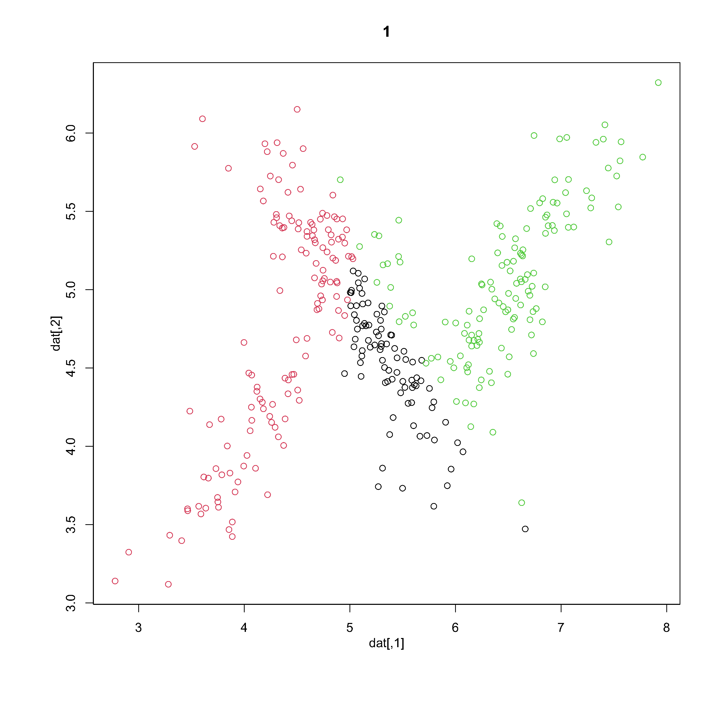

---
params:
  update_date: FALSE
date: "`r source('_supp/helper.R'); newdate_func(params$update_date)`"
title: "Thuật Toán Expectation-Maximization (EM) (3/3)"
subtitle: "Phần III - `r totitle('bài toán phân cụm',icon ='')`"
output: 
  bookdown::html_document2:
    code_folding: hide
    number_sections: true
bibliography: ["_supp/citation.bib"]
link-citations: true
---

\newcommand{\bf}[1]{\boldsymbol{#1}}
\newcommand{\hat}[1]{\widehat{#1}}
\newcommand{\mm}[1]{\mathbb{#1}}
\newcommand{\bar}[1]{\overline{#1}}
\newcommand{\tp}[1]{{#1}^{\top}}
\newcommand{\scr}[1]{\mathscr{#1}}


\def\E{\Bbb{E}}
\def\V{\Bbb{V}}
\def\P{\Bbb{P}}
\def\I{{\large\unicode{x1D7D9}}}
\def\indep{\perp\!\!\!\!\perp}
\newcommand{\overeq}[2]{\stackrel{#1}{#2}}
\def\epsilon{\varepsilon} 
\def\proved{\blacksquare\quad} 
---


```{r setup, include=FALSE}
knitr::opts_chunk$set(echo = FALSE, warning = FALSE, message = FALSE)
source("_supp/helper.R")
library(tidyverse)
```


# Đặt vấn đề

Ta lại tiếp tục xem xét một dạng bài thuộc nhóm phân cụm trong machine learning, và bài này sẽ được giải bằng phương pháp EM. Ta nhắc lại cấu trúc bài toán "hai đồng xu" trong bài số 1 lần trước. Trong bài toán "hai đồng xu" ta xem xét trường hợp khi ta phải chọn 2 đồng xu, mỗi đồng xu có xác suất mặt hình không giống nhau. Ta ngẫu nhiên chọn ra 1 đồng xu rồi tung đồng xu 5 lần, ta lập lại 2 bước trên 10 lần.Như vậy ta thấy rằng mỗi một đổng xu đại diện cho 1 nhóm, tạm gọi là A và B. khi một đồng xu được chọn và tung 5 lần, ta có một phân bố nhị thức với parameters của nó là $5$ và $p_i$, với $i \in \{A,B\}$. Nghĩa là ta có $\P(X|A)$ và $\P(X|B)$ đều là phân bố nhị thức, nghĩa là $X|A \sim \mathcal{Bin}(5,p_A)$ và $X|B \sim \mathcal{Bin}(5,p_B)$. Ngoài ra, ta cũng được cung cấp  một thông tin rằng đồng xu $A$ được chọn với xác suất là là $\pi_A$, như vậy xác suất để đồng xu B được chọn là $1-\pi_A$. Rõ ràng, hành động chọn đồng xu A hoặc B lại là một phân bố bernoulli với parameter của nó là $\pi_A$, nghĩa là $Z \sim \mathcal{Bin}(1,\pi_A)$. Với dạng bài này, ta gọi là phân bố hỗn hợp, vì nó kết hợp giữa 2 phân bố nhị thức bằng một phân bố bernoulli (bernoulli cũng là phân bố nhị thức với parameter $n =1$).

Lần này ta cũng xét một bài tương tự. Với một tập dữ liệu $X$ có chiều không gian $n\times p$ và một biến target $y \in \{1,2,3\}^{n}$. Nếu giả định ban đầu mỗi một hàng trong tập dữ liệu $X$ thuộc một phân bố multivariate normal, và $X$ bao gồm các quan sát thuộc 3 phân bố multiviriate normal khác nhau, thì đây cũng là một dạng bài phân bố hỗn hợp. Nhưng lần này là 3 phân bố multivariate normal được kết hợp bằng một phân bố tam thức $Z \sim Trinomial(n,p_1,p_2)$. 

# Data giả lập

Đầu tiên ta sẽ tạo một data có dạng như sau. Ta sẽ tạo ra một tập dữ liệu bao gồm 360 observations, với mỗi observation thuộc một trong ba phân bố binormal:
$$
\begin{aligned}
&f(x|z_1) \sim BN\bigg(\begin{bmatrix}4\\4\end{bmatrix}, \begin{bmatrix}0.25 & 0.21\\ 0.21 & 0.25\end{bmatrix}\bigg); \\
&f(x|z_2) \sim BN\bigg(\begin{bmatrix}5\\5\end{bmatrix}, \begin{bmatrix}0.25 & -0.21\\ -0.21 & 0.25\end{bmatrix}\bigg); \\
&f(x|z_3) \sim BN\bigg(\begin{bmatrix}6.5\\5\end{bmatrix}, \begin{bmatrix}0.25 & 0.21\\ 0.21 & 0.25\end{bmatrix}\bigg)
\end{aligned}
$$
vói $Z \sim Trinomial(360,0.2,0.5)$, trong thực tế các giá trị này sẽ không được biết, và nhiệm vụ của ta là ước lượng những giá trị này. 

```{r, warning=FALSE, message=FALSE, fig.align='center', fig.cap="*Dữ liệu X nếu thông tin từ Z được cung cấp*",echo=TRUE}
library(purrr)
library(tidyverse)

n = 360
mu <- matrix(c(4.0,4.0, 5.0,5.0,6.5,5.0), ncol=2, byrow=T)
mu = purrr::map(1:3, ~mu[.,])
sig<-
purrr::map(
 list(c(.25, .21, .21,.25), 
      c(.25,-.21,-.21,.25),
      c(.25, .21, .21,.25)),
 matrix, nrow = 2, byrow = T
)
p = c(0.2,0.5,0.3)
y = sample(1:3,n, replace = T, prob = p )

set.seed(111)
dat<-
purrr::map(y, ~MASS::mvrnorm(1, mu = mu[[.]], Sigma=sig[[.]]))%>%
 reduce(rbind)
color = c("red","blue","black")
plot(dat, col = color[y], xlab = "x1", ylab = "x2")
```

như vậy, nếu phân bố của $Z$ không được biết thì tập giá trị ta có như sau 

```{r, fig.align='center', fig.cap="*Dữ liệu X khi thông tin của Z không được cung cấp.*"}
plot(dat, xlab = "x1", ylab = "x2")
```

Mục tiêu của ta là sẽ đi phân cụm cho tập dữ liệu này. 

# Phân cụm bằng phương pháp EM

Mỗi một quan sát sẽ có xác suất là $\pi_k\mathcal{N}(\bf{\mu}_k,\bf{\Sigma}_k)$, như vậy ta sẽ có phương trình likelihood là 
$$
L(\theta) = \prod_{i=1}^N\prod_{k=1}^K[\pi_k\mathcal{N}(\bf{\mu}_k,\bf{\Sigma}_k)]^{z_{ik}}
$$
và suy ra hàm log-likelihood
$$
l(\theta) = \sum_{i =1}^N\sum_{k=1}^Kz_{ik}[\ln\pi_k+\ln\mathcal{N}(\bf{\mu}_k, \bf{\Sigma}_k)]
(\#eq:eq1)
$$

**Trong bước E**, ta sẽ xác định $\E[l(\theta)]$:
$$
\E[l(\theta)] = \sum_{i =1}^N\sum_{k=1}^K\gamma(z_{ik})[\ln\pi_k+\ln\mathcal{N}(\bf{\mu}_k,\bf{\Sigma}_k)]
$$
Trong đó 
$$
\gamma(z_{ik}) = \frac{\pi_k\mathcal{N}(\bf{x}_i|\bf{\mu}_k,\bf{\Sigma}_k)}{\sum_{k=1}^K\pi_k\mathcal{N}(\bf{x}_i|\bf{\mu}_k,\bf{\Sigma}_k)}
(\#eq:eq2)
$$
**Trong bước M**, ta lấy đạo hàm `r lb(eq1)` theo biến $\bf{\mu}_k$, $\bf{\Sigma}_k$ và $\pi_k$, cho đạo hàm bằng 0, ta sẽ có 
$$
\begin{aligned}
\bf{\mu}_k &= \frac{\sum_{i=1}^N\gamma(z_{ik})\bf{x}_i}{\sum_{i=1}^N\gamma(z_{ik})} \\
\bf{\Sigma}_k &= \frac{\sum_{i=1}^N\gamma(z_{ik})(\bf{x}_i-\bf{\mu}_k)\tp{(\bf{x}_i-\bf{\mu}_k)}}{\sum_{i=1}^N\gamma(z_{ik})} \\
\pi_k &= \frac{\sum_{i=1}^N\gamma(z_{ik})}{N}
\end{aligned} 
(\#eq:eq3)
$$

Sử dụng `r lb(eq2)` và `r lb(eq3)` để viết `R code` như bên dưới


```{r, echo=TRUE, eval=FALSE}
library(mvtnorm)
d <- ncol(dat) # number of dimensions
N <- nrow(dat) # number of samples
K=3
ranges <- apply(dat, 2, range) # the ranges for each dimension
# initial values
pik <- rep(1/K,K)
muk = apply(ranges,2, function(i) runif(3,i[1],i[2]))
muk = lapply(1:3, function(i) muk[i,])
Sigmas <- lapply(1:3, function(i) matrix(c(1,0,0,1),nrow = 2))

for(iter in 1:30){
# EM steps
gammak<-
purrr::pmap(list(pik,muk,Sigmas), ~{
 apply(dat,1, function(i) ..1*dmvnorm(i,..2,..3) )
})%>% purrr::pmap(~ c(...)%>%{./sum(.)})%>%
 reduce(rbind)
 
# M step
pik<-t(gammak)%*%rep(1,N)/N
muk = apply(gammak,2, function(i) t(dat)%*%i/sum(i) )%>%
 {lapply(1:3, function(i) .[,i] )}

gammak = lapply(1:ncol(gammak), function(i) gammak[,i] )

Sigmas<-
pmap(list(muk, gammak), ~{
 m = t(apply(dat,1, function(j) (j-..1)))
 lapply(1:nrow(m), function(i) m[i,]%*%t(m[i,])*..2[i]/sum(..2))%>%
  reduce(`+`)
})

pred = reduce(gammak,cbind)%>%apply(1, which.max)

# #create animated images
# 
# f = function()  plot(dat, col = pred, main = paste0(iter))
# k = ggplotify::as.ggplot(f)
# if(!dir.exists("_supp/myfolder")) dir.create("_supp/myfolder")
# ggsave(plot = f, filename =  paste0("_supp/myfolder/",iter,".png"), device = "png")

}

# ## list file names and read in
# imgs <- list.files("_supp/myfolder", full.names = TRUE)
# img_list <- lapply(imgs, magick::image_read)
# ## join the images together
# img_joined <- magick::image_join(img_list)
# ## animate at 2 frames per second
# img_animated <- magick::image_animate(img_joined, fps = 1)
# ## save to disk
# magick::image_write(image = img_animated,
#             path = "img/img1.gif")
# unlink("_supp/myfolder", recursive = TRUE)


b1 = sort(table(pred))
b2 = sort(table(y))
a = cbind(names(b2)%>% as.numeric(), names(b1)%>% as.numeric())
y = sapply(y, function(i)  a[match(i,a[,1]),2])
confu = table(pred,y)%>% broom::tidy()
save(confu, file = "_supp/confu1.RData")
```

```{r fig1, fig.align='center', fig.cap="*Quá trình thay đổi biến target trong 30 iterations*"}

```

Phương pháp EM đã có package sẵn trong `R` để chạy với tốc độ khá nhanh, tuy nhiên với mục đích học và hiểu, trong bài này ta sẽ tự code thủ công. 

Như trong `r lb(fig1)` ta thấy rằng qua mỗi lần iteration, thì các observations lại thay đổi qua lại trong 3 cụm. Càng về cuối thì sự thay đổi này càng ít đi và đến cuối cùng thì dường như không còn thay đổi nữa. 

Sau 30 lần chạy, ta sẽ có kết quả được thể hiện như trong bảng confusion `r lb(fig2)` bên dưới

```{r fig2, echo=TRUE, message=FALSE, warning=FALSE, fig.align='center', fig.cap= "*Bảng confusion thể hiện tỉ lệ dự đoán đúng và sai theo trong từng trường hợp.*"}
load("_supp/confu1.RData")
cvms::plot_confusion_matrix(confu,target_col = "y", prediction_col = "pred",
                                                  counts_col = "n")
```
Như vậy tỉ lệ dự đoán chính xác lên đến `r 48.3+25+19.4`% chính là tồng phần trăm thể hiện trên đường chéo của `r lb(fig2)`. 


<!-- ----------------------------------------------------------------------------- -->

<!-- # _References_ {-} -->
