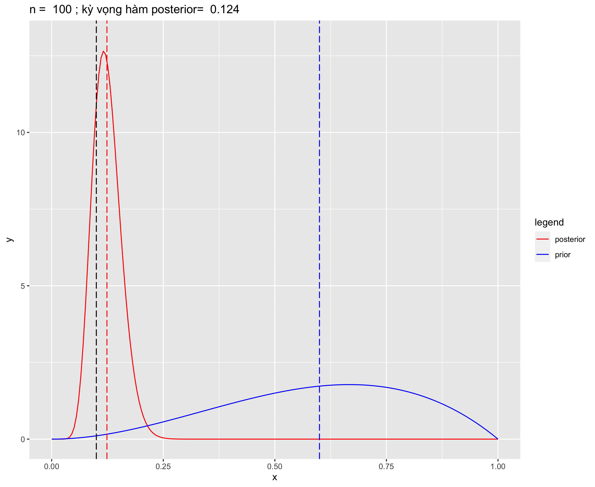

---
params:
  update_date: FALSE
date: "`r source('_supp/helper.R'); newdate_func(params$update_date)`"
title: "`r totitle('giới thiệu bayes')`"
output: 
  bookdown::html_document2:
    code_folding: hide
    scroll_highlight: yes
    number_sections: true
    toc_depth: 3
bibliography: ["_supp/citation.bib"]
link-citations: true
---

\newcommand{\bf}[1]{\boldsymbol{#1}}
\newcommand{\hat}[1]{\widehat{#1}}
\newcommand{\mm}[1]{\mathbb{#1}}
\newcommand{\bar}[1]{\overline{#1}}
\newcommand{\tp}[1]{{#1}^{\top}}
\newcommand{\scr}[1]{\mathscr{#1}}


\def\E{\Bbb{E}}
\def\V{\Bbb{V}}
\def\P{\Bbb{P}}
\def\I{{\large\unicode{x1D7D9}}}
\def\indep{\perp\!\!\!\!\perp}
\newcommand{\overeq}[2]{\stackrel{#1}{#2}}
\def\epsilon{\varepsilon} 
\def\logit{\text{logit}} 


::: {.right .shad}
[tham khảo tại @held2020]
:::

::: {.watermark}
*DRAFT*
:::

```{r setup, include=FALSE}
knitr::opts_chunk$set(echo = FALSE, warning = FALSE, message = FALSE)
options("scipen"=100)
source("_supp/helper.R")
library(tidyverse)
ttt = purrr::partial(totitle, icon ="")
```

***
:::{.right}
`r button1 = collapsable_button('Terminologies'); button1[[1]]`
:::

`r button1[[2]]`
:::{.whitebox}
| English | Vietnamese |
|---------|------------|
| likelihood | hợp lý |
| prior | tiên nghiệm |
| posterior | hậu nghiệm |
| parameter | tham số |
| conjugate | liên hợp |
| improper | phi chính |
| invariance | tính bất biến |
:::
`r button1[[3]]`

# `r ttt('công thức bayes')`

Ta sẽ bắt đầu nội dung này bằng cách nhắc lại công thức _Bayes_ được phát biểu như sau 
$$
\P(\Theta|X) = \frac{\P(X|\Theta)\P(\Theta)}{\P(X)},
(\#eq:eq1)
$$

với $\Theta$ và $X$ lần lượt là 2 sự kiện xảy ra trong một thí nghiệm. 

:::{.example #exm1}
Ta chọn ngẫu nhiên một trong hai đồng xu I và II với xác suất mặt hình lần lượt là $p_1=0.4$ và $p_2=0.7$, rồi tung đầu xu đó $n$ lần. Sẽ cò 2 hành động ta cần xem xét, hành động thứ nhất là "chọn một trong hai đồng xu", gọi xác suất đồng xu I được chọn là $\theta = 0.5$, như vậy xác suất đồng xu II được chọn là $1-\theta = 0.5$. Hành động thứ hai là tung đồng xu $n$ lần.Ta muốn xác định $\theta$ sau khi quan sát kết quả số mặt hình thu được sau khi tung đồng xu, nghĩa là $\P(\Theta|X)$. 
:::

Trong `r lb(exm1)` ta có thể thấy được rằng 2 hành động đều thuộc phân bố binomial, trong đó hành động chọn 1 trong 2 đồng xu là phân bố binomial với 2 tham số là $n =1$ và $p = \theta$, như vậy ta có $\Theta \sim \mathcal{Bin}(1,\theta)$. Hành động tung đồng xu $n$ lần cũng là một phân bố binomial có điều kiện. Nghĩa là tùy thuộc vào đồng xu được chọn mà ta sẽ có phân bố binomial với tham số khác nhau. Như vậy 2 phân bố binomial sẽ có dạng
$$
X|\Theta = \theta \sim \mathcal{Bin}(n,p_1); \quad X|\Theta = 1-\theta \sim \mathcal{Bin}(n,p_2)
$$

Để đơn giản ta sẽ xem xét trường hợp khi $n=10$. Như vậy nếu như sau 10 lần tung đồng xu ta thu được 7 mặt hình và 3 mặt chữ. Ta sẽ tính được xác suất này cho từng đồng xu như sau
$$
\P(X|\Theta = \theta) = {10 \choose 7}0.4^{7}0.6^{3}, \quad 
\P(X|\Theta = \theta) = {10 \choose 7}0.7^{7}0.3^{3}, 
$$

kết quả bằng `r dbinom(7,10,0.4)` và `r dbinom(7,10,0.7)`. Sử dụng `r lb(eq1)` ta có
$$
\P(\Theta|X) = \frac{\P(X|\Theta = \theta)\P(\Theta=\theta)}{\P(X|\Theta = \theta)\P(\Theta=\theta)+\P(X|\Theta = 1-\theta)\P(\Theta=1-\theta)}
$$
kết quả bằng `r dbinom(7,10,0.4)/(dbinom(7,10,0.4)+dbinom(7,10,0.7))`, và đây là xác suất đồng xu I được chọn. `r proved()` 

:::{.whitebox}
Kết quả này rất hợp lý vì đồng xu I có xác suất mặt hình nhỏ hơn mặt chữ trong khi đồng xu II thì có xác suất mặt hình lớn hơn mặt chữ. Từ data $X$ ta thấy rằng ta thu đượt 7 mặt hình và 3 mặt chữ, tức là mặt hình nhiều hơn mặt chữ, vì thế trong điều kiện của $X = 7$ thì khả năng đồng xu số I đã được chọn là nhỏ hơn đồng xu II. 
:::

Nếu ta tung đầu xu lên 10 lần, và tùy vào số mặt hình thu được, xác suất đồng xu I được chọn cũng thay đổi. Ta có thể vẽ biểu đồ sau đề thấy sự biến thiên của xác suất đồng xu I được chọn

```{r fig1, fig.align='center', fig.cap="*Xác suất đồng xu I được chọn sau khi quan sát tập dữ liệu X.*"}
thet = sapply(0:10, function(i) dbinom(i,10,0.4)/(dbinom(i,10,0.4)+dbinom(i,10,0.7)))
ggplot(tibble(x = 0:10, y= thet), aes(x=x, y= y))+
  geom_line(linetype =5, color = "grey60")+ 
  geom_point()+
  scale_x_continuous(breaks = 0:10)+
  labs(x = "Số mặt hình", y="xác suất đồng xu I được chọn sau khi X được quan sát")+
  theme_bw()
```

# `r ttt('phân bố hậu nghiệm (posterior)')`

Nếu như trong công thức `r lb(eq1)` xác suất điều kiện được viết bằng hàm xác suất khối (probability mass function-PMF) với 2 sự kiện $\Theta$ và $X$, thì đối với tập dữ liệu liên tục ta sẽ viết thành
$$
f(\theta|x) = \frac{f(x|\theta)f(\theta)}{f(x)} = 
\frac{f(x|\theta)f(\theta)}{\int_{\Theta} f(x|\theta)f(\theta)d\theta}.
(\#eq:eq2)
$$
Phương trình `r lb(eq2)` là dạng tổng quát của `r lb(eq1)` có thể đại diện cho cả phân bố liên tục và rời rạc (trong trường hợp rời rạc thì dấu tích phân $\int$ dưới mẫu đổi thành phép tổng $\sum$). Và đây gọi là *phân bố hậu nghiệm*. Ngoài ra, hàm $f(x|\theta)$ và $f(\theta)$ lần lượt là hàm *hợp lý (likelihood)* và *hàm tiên nghiệm (prior)*. Một lưu ý nữa là phần tích phân dưới mẫu số của `r lb(eq2)` được tính trên tập xác định của $\theta$ nên kết quả độc lập với $\theta$, và vì thế ta có thể viết thành
$$
f(\theta|x) \propto f(x|\theta)f(\theta)
$$

## `r ttt('ước lượng điểm')`

Một khi đã xác định được hàm phân bố hậu nghiệm, ta có thể tính được ước lượng điểm theo Bayes (bayesian point estimate) bao gồm kỳ vọng (mean), trung vị (median) hay yếu vị (mode) của hàm hậu nghiệm. Kỳ vọng của hàm hậu nghiệm là
$$
\E(\theta|x) = \int\theta f(\theta|x)d\theta,
(\#eq:eq3)
$$
trung vị là
$$
Med(\theta|x) = \bigg\{m : \int_{-\infty}^mf(\theta|x)d\theta = 0.5 \land \int_m^{\infty}f(\theta|x)d\theta =0.5 \bigg\} 
(\#eq:eq4)
$$
và yếu vị là
$$
Mod(\theta|x) = \arg\max_{\theta \in \Theta}f(\theta|x)
(\#eq:eq5)
$$

## `r ttt('ước lượng khoảng')`

Ngoài ra ta có thể xác định ước lượng khoảng dựa vào hàm hậu nghiệm, được gọi là khoảng tin cậy (credible interval). Khoảng tin cậy được định nghĩa là $L$ và $U$ nếu
$$
\int_{L}^Uf(\theta|x)d\theta = 1-\alpha
(\#eq:eq6)
$$

Ta kết luận rằng $\theta \in (L,U)$ với xác suất là $(1-\alpha)100\%$. 

::::{.blackbox .brainstorm}
:::{.center}
Lưu ý:
:::
Khoảng tin cậy được lấy từ hàm hậu nghiệm có ý nghĩa khác với khoảng tin cậy theo phương pháp frequentist thông thường. Với phương pháp frequentist, thì tham số $\theta$ không phải là một biến ngẫu nhiên mà là một giá trị cố định nhưng không được biết, nghĩa là nó không có xác suất hoặc là xác suất của nó chỉ là $1$ hoặc $0$. Vì thế khoảng tin cậy của nó được giải thích là nếu ta lập lại thí nghiệm nhiều lần thì $(1-\alpha)100\%$ trong số đó sẽ chứa giá trị đúng của $\theta$. Trong khi theo trường phái Bayes thì $\theta$ là một biến ngẫu nhiên và phân bố của nó chính là phân phố hậu nghiệm, nên ta có thể kết luận bằng khái niệm xác suất.
::::

:::{.example #exm2}
Ta có một đồng xu với xác suất mặt hình là $\theta$, nhiệm vụ của ta là ước lượng giá trị $\theta$. Để thực hiện, ta bắt đầu làm một thí nghiệm bằng cách tung đồng xu $n$ lần và xem xét số mặt hình thu được. Ví dụ ta biết rằng $\theta$ là một biến ngẫu nhiên thuộc phân bố $\mathcal{Beta}$, ta có 
$$
\theta \sim \mathcal{Beta}(\alpha,\beta) \\
f(\theta) = {n\choose x}\theta^x(1-\theta)^{n-x}
$$ 
và 
$$
X|\theta \sim \mathcal{Bin}(n,\theta)\\
f(x|\theta) = \frac{1}{\mathcal{B}(\alpha,\beta)}\theta^{\alpha-1}(1-\alpha)^{\beta-1}
$$
Như vậy ta có thể suy ra rằng
$$
\begin{aligned}
f(\theta|x) &\propto f(x|\theta)f(\theta) \\
&= \theta^x(1-\theta)^{n-x}\theta^{\alpha-1}(1-\theta)^{\beta-1}\\
&= \theta^{\alpha+x-1}(1-\theta)^{\beta+n-x-1}
\end{aligned}
$$
Như vậy ta sẽ có
$$
\theta|x \sim \mathcal{Beta}(\alpha+x,\beta+n-x)
(\#eq:eq7)
$$
:::

Từ kết quả của `r lb(eq7)` ta có thể tính được kỳ vọng của $\theta|x$

$$
\begin{aligned}
\E(\theta|x) &= \frac{\alpha+x}{\alpha+\beta+n} \\
&= \underbrace{\frac{\alpha+\beta}{\alpha+\beta+n}}_{\text{tỉ lệ khối }\pi}\underbrace{\frac{\alpha}{\alpha+\beta}}_{\E(\theta)}+\underbrace{\frac{n}{\alpha+\beta+n}}_{\text{tỉ lệ khối }1-\pi}\underbrace{\frac{x}{n}}_{\E(X)}
\end{aligned}
(\#eq:eq8)
$$
Dựa vào `r lb(eq8)` ta thấy rằng kỳ vọng của hàm hậu nghiệm chính là trung bình cộng của kỳ vọng hàm tiên nghiệm và kỳ vọng hàm hợp lý. Ta thấy rằng nếu $n \to 0$ thì $\pi \to 1$ và kỳ vọng của hàm hậu nghiệm tiến gần đến kỳ vọng của hàm tiên nghiệm, còn nếu $n \to \infty$ thì kỳ vọng hàm hậu nghiệm tương đương kỳ vọng hàm hợp lý. Điều này thể hiện rõ trong `r lb(fig2)`.

```{r fig2, fig.align='center', fig.cap="*phân bố hậu nghiệm và phân bố tiên nghiệm biến thiên theo giá trị của n.*"}

```

Bên cạnh đó ta cũng thấy rằng phần tử số của tỉ lệ khối $(1-\pi)$ là $n$ chính là kích cỡ mẫu của tập dữ liệu, như vậy ta có thể suy ra rằng phần tử số của tỉ lệ khối $\pi$ là $(\alpha+\beta)$ chính là kích cỡ mẫu của hàm tiên nghiệm. 

Ta cũng biết rằng $\mathcal{Beta}(1,1) \sim \mathcal{Unif}(0,1)$, hàm tiên nghiệm này mang ý nghĩa là ta không hề có bất kỳ thông tin nào về $\theta$ trước khi ta quan sát tập dữ liệu. Vì kích cỡ mẫu của hàm tiên nghiệm bấy giờ là $\alpha+\beta =2$, 1 success và 1 failure. Khi đó kỳ vọng của hàm hậu nghiệm là $(x+1)/(n+2)$ và yếu vị của hàm hậu nghiệm chính là $\hat{\theta}_{MLE} = \bar{x}$ [@held2020]. `r proved()`

# `r ttt('Chọn hàm tiên nghiệm')` (chọn nguồn thông tin trước khi tập dữ liệu được quan sát)

Về mặt ý nghĩa hàm tiên nghiệm đại diện cho nguồn thông tin (information hay knowledge) mà ta có trước khi ta quan sát từ tập dữ liệu. Vì thế nó còn được hiểu nôm na là "ý trời" (what God says) bởi vì thông tin này không dựa vào evidence (ở đây là data mà ta có) nên nó là một thông tin mang tính chất chủ quan (subjective belief). Thực tế hơn thì đây chính là nguồn thông tin bên ngoài (external information) mà ta có thể tìm kiếm được từ kết quả của những nghiên cứu tương tự đã được thực hiện trước đó. Về mặt thống kê học thì chọn hàm tiên nghiệm nghĩa là chọn một phân bố cho tham số mà ta muốn ước lượng trước khi ta có thể quan sát data, từ đó kết hợp với thông tin được chứa đựng trong tập dữ liệu để cho ra một giá trị ước lượng mang thông tin của cả hàm tiên nghiệm và hàm hợp lý. Tuy nhiên không phải bất kỳ phân bố nào cũng có thể chọn để làm hàm tiên nghiệm vì một số hàm tiên nghiệm sẽ gây khó khăn trong việc tính toán hàm hậu nghiệm. Phần này ta xem xét cách để chọn một hàm tiên nghiệm phù hợp.

## `r ttt('hàm tiên nghiệm liên hợp (prior conjugate)')`

Lựa chọn đầu tiên được gọi là *hàm tiên nghiệm liên hợp*, là một hàm tiên nghiệm được chọn sao cho hàm hậu nghiệm và hàm piror cùng thuộc một họ phân bố, nghĩa là nếu hàm tiên nghiệm là một phân bố $\mathcal{Beta}$ thì hàm hậu nghiệm cũng là một phân bố $\mathcal{Beta}$. Định nghĩa bằng ngôn ngữ toán học là 

::: {.definition #def1 name="Hàm tiên nghiệm liên hợp" style="border: thin solid black; padding-left: 10px;"}
Cho $L(\theta) = f(x|\theta)$ là hàm hợp lý, $\mathscr{G}$ được gọi là một họ phân bố liên hợp tương ứng với $L(\theta)$ nếu $f(\theta|x) \in \mathscr{G} \Leftrightarrow f(\theta) \in \mathscr{G}, \forall x$.
:::

::: {.example #exm3}
Ta xem lại trong `r lb(exm2)`, ta có $\theta \sim \mathcal{Beta}(\alpha,\beta)$ và $\theta|x \sim \mathcal{Beta}(\alpha+x, \beta+n-x)$. Cả 2 phân bố đều thuộc họ phân bố $\mathcal{Beta}$ nên $\mathcal{Beta}(\alpha,\beta)$ trong trường hợp này là một hàm tiên nghiệm liên hợp. `r proved()`
:::

Thay vì xem xét tình trường hợp riêng lẽ, ta sẽ xem xét hàm tiên nghiệm liên hợp thuộc họ phân bố _exponential_ là một họ phân bố của hầu hết các phân bố được sử dụng phổ biến trong phân tích hiện nay. Một phân bố được cho là thuộc họ exponential khi hàm mật độ xác suất (probability density function) của nó có thể viết dưới dạng
$$
f(x_i|\theta) = f(x_i)g(\theta)\exp\big\{\tp{\phi(\theta)} u(x_i)\big\} ,
(\#eq:eq9)
$$
trong `r lb(eq9)` ta cần chú ý 4 thành phần, thứ nhất là $f(x_i)$ là một hàm số của tập dữ liệu, độc lập với $\theta$, $g(\theta)$ một hàm số của tham số $\theta$ độc lập với dữ liệu $x_i$. Hai thành phần quan trọng nhất chính là $\phi(\theta)$ và $u(x_i)$ trong khi cái đầu là một hàm số của riêng $\theta$ thì cái thứ hai là hàm số của riêng $x_i$. Nếu ta lấy loragit tự nhiên ta sẽ được
$$
f^*(x_i) + g^*(\theta) + \tp{\phi(\theta)}u(x_i),
$$
ta thấy rằng logarit tự nhiên của hàm hợp lý của $\theta$ phụ thuộc vào data $x_i$ thông qua hàm $u(x_i)$, vì thế $u(x_i)$ được gọi là *thống kê đủ (sufficient statistic)* của $\theta$. Như vậy 
nếu như hàm phân bố tiên nghiệm của $\theta$ cũng thuộc họ exponential thì 
$$
f(\theta) \propto g(\theta)^{\eta}e^{\tp{\phi(\theta)}\xi},
$$
thì hàm hậu nghiệm sẽ có dạng
$$
f(\theta|x_i) = g(\theta)^{1+\eta}e^{\tp{\phi(\theta)}(\xi+t(x_i))},
$$
chỉ ra rằng hàm tiên nghiệm được chọn là một hàm tiên nghiệm liên hợp. Ta có thể chứng minh rằng họ exponential là một họ của những phân bố có các hàm phân bố liên hợp, bởi vì những phân bố có số thống kê đủ cố định với mọi $n$ ($n$ là số observations trong tập dữ liệu) đều thuộc họ exponential [@gelman2013]. 

::: {.example #exm4}
Trong `r lb(exm2)` ta có $X|\theta \sim \mathcal{Bin}(n,\theta)$ và $\theta \sim \mathcal{Beta}(\alpha,\beta)$. Ta có thể chỉ ra rằng cả 2 phân bố này đều thuộc họ exponential. 

Ta sẽ chứng minh Binomial là một phân bố thuộc họ exponential như sau, 
$$
\begin{align}
f(x|\theta) &= {n \choose x}\theta^{x}(1-\theta)^{n-x} \\
&={n \choose x}(1-\theta)^n\exp\bigg[x\ln\Big(\frac{\theta}{1-\theta}\Big)\bigg]
\end{align}
$$
như vậy $\phi(\theta)$ chính là $\logit(\theta)$. 

Với phân bố $\mathcal{Beta}$ ta có 
$$
\begin{aligned}
f(\theta) &\propto \theta^{\alpha-1}(1-\theta)^{\beta-1} \\
&= \bigg(\frac{\theta}{1-\theta}\bigg)^{\alpha-1}(1-\theta)^{\beta+\alpha-2} \\
&= (1-\theta)^{\beta+\alpha-2}e^{(\alpha-1)\ln(\frac{\theta}{1-\theta})}.
\end{aligned}
$$

Như vậy nếu kết hợp với hàm hợp lý ở trên ta sẽ có 
$$
f(\theta|x)  = {n \choose x}(1-\theta)^{n+\alpha+\beta-2}\exp\Big[(x+\alpha-1)\logit(\theta)\Big],
$$
cũng là một phân bố thuộc họ exponential. Nếu ta bỏ đi phần ${n\choose x}$ vế phải ta sẽ có 
$$
(1-\theta)^{n+\alpha+\beta-2}\frac{\theta^{x+\alpha-1}}{(1-\theta)^{x+\alpha-1}} = 
\theta^{x+\alpha-1}(1-\theta)^{\beta+n-x-1},
$$
ứng với phân bố $\mathcal{Beta}(x+\alpha,\beta+n-x)$ giống với kết quả của `r lb(eq7)`. `r proved()`
:::

Một dạng so sánh khá phổ biến trong thống kê đó là so sánh tỉ lệ giữa 2 quần thể khác nhau, ví dụ như ta muốn so sánh tỉ lệ tử vong của 2 nhóm bệnh nhân đã sử dụng 2 phương pháp điều trị khác nhau. Ta sẽ xem xét trường hợp này trong ví dụ tiếp theo

::: {.example .exm5}
Ta có 2 biến ngẫu nhiên thuộc 2 phân bố binomial như sau
$$
X_1 \sim \mathcal{Bin}(n_1,p_1), \quad X_2 \sim \mathcal{Bin}(n_2,p_2),
$$
ta muốn so sánh $p_1$ và $p_2$, _hệ số ảnh hưởng (effect size)_ thường được sử dụng là *tỉ số odds (odds ratio)*:
$$
\theta = \frac{p_1/(1-p_1)}{p_2/(1-p_2)},
$$
thông qua hàm logarit tự nhiên, nghĩa là $\Omega=\ln\theta$.

Với một phân bố binomial ta biết rằng ước lượng hợp lý cực đại (maximum likelihood estimator - MLE) là $x_i/n_i$ với $i \in \{1,2\}$. Như vậy ta sẽ có $\hat{\Omega}_{MLE} = \ln\frac{x_1(n_2-x_2)}{x_2(n_1-x_1)}$. Nếu như ta chọn phân bố tiên nghiệm của $\Omega$ thuộc phân bố chẩn với kỳ vọng bằng 0 và phương sai thật lớn. Ta sẽ có phân bố hậu nghiệm là 
$$
\Omega|\hat{\Omega}_{MLE} \sim \mathcal{N}(\hat{\Omega}_{MLE},\sigma^2)
$$
Khi đó cả 3 ước lượng điểm là kỳ vọng, trung vị và yếu vị đều bằng nhau và bằng ước lượng tính theo hàm hợp lý cực đại. Với lựa chọn hàm tiên nghiệm là phân bố chuẩn với phương sai là một số lớn tiến về vô cùng, sẽ tương đương với chọn phân bố tiên nghiệm thuộc hàm uniform, nghĩa là $f(\Omega) \propto 1$. Khi đó hàm tiên nghiệm được chọn gọi là tiên nghiệm phi chính, ta sẽ xem xét ở phần sau. 

Đối với ví dụ này, xét trên phương diện ứng dụng thực tế thì rất hiếm xảy ra. bởi vì với lựa chọn tiên nghiệm phi chính thì  xác suất của tỉ số odd giữa 0.5 và 2 cũng sẽ bằng với xác suất của tỉ số odd giữa 11000 và 44000, bởi vì cả hai đều cho ra $\ln(4)$. Và với một hệ số ảnh hưởng lớn như thế là điều không thể xảy ra trong thực tế.  
:::

Với lựa chọn tiên nghiệm liên hợp ta có một vài kết quả như sau 

|hàm hợp lý|hàm tiên nghiệm liên hợp|hàm hậu nghiệm|
|---|---|---|
|$X|\pi\sim\mathcal{Bin}(n,\pi)$|$\pi\sim\mathcal{Be}(\alpha,\beta)$|$\pi|x\sim\mathcal{Be}(\alpha+x,\beta+n-x)$|
|$X|\pi\sim\mathcal{Geo}(\pi)$|$\pi\sim\mathcal{Be}(\alpha,\beta)$|$\pi|x\sim\mathcal{Be}(\alpha+1,\beta+x-1)$|
|$X|\lambda\sim\mathcal{Po}(e.\lambda)$|$\lambda\sim\mathcal{Gam}(\alpha,\beta)$|$\lambda|x\sim\mathcal{Gam}(\alpha+x,\beta+e)$|
|$X|\lambda\sim\mathcal{Exp}(\lambda)$|$\lambda\sim\mathcal{Gam}(\alpha,\beta)$|$\lambda|x\sim\mathcal{Gam}(\alpha+1,\beta+x)$|
|$X|\mu\sim\mathcal{N}(\mu,\sigma^2)$,$\sigma^2$ is known|$\mu\sim\mathcal{N}(\eta,\tau^2)$|$\mu|x\sim\mathcal{N}\Big[\big(\frac{1}{\sigma^2}+\frac{1}{\tau^2}\big)^{-1}\big(\frac{x}{\sigma^2}+\frac{\eta}{\tau^2}\big),\big(\frac{1}{\sigma^2}+\frac{1}{\tau^2}\big)^{-1}\Big]$|
|$X|\sigma^2\sim\mathcal{N}(\mu,\sigma^2)$, $\mu$ is known|$\sigma^2 \sim\mathcal{IG}(\alpha,\beta)$|$\sigma^2|x\sim\mathcal{IG}[\alpha+1/2,\beta+(1/2)(x-\mu)^2]$|


## `r totitle('hàm tiên nghiệm phi chính (improper prior)','')`

Lựa chọn thứ 2 cho hàm tiên nghiệm là *tiên nghiệm phi chính*, được định nghĩa khi một phân bố có 
$$
\int_{\Theta}f(\theta)d\theta =  \infty, \text{ hoặc } \sum_{\Theta}f(\theta) = \infty
$$
một ví dụ điển hình là tham số $p$ của một phân bố nhị thức thuộc phân bố $\mathcal{Beta}$ với cả hai tham số $\alpha = \beta = 0$, nghĩa là $p \sim \mathcal{Beta}(0,0)$. 

## `r ttt('hàm tiên nghiệm của Jeffrey')`

Ta biết rằng tiên nghiệm phi chính được sử dụng trong trường hợp ta không có hoặc có rất ít thông tin về một đại lượng nào đó trước khi ta quan sát dữ liệu. Lựa chọn đầu tiên là tiên nghiệm phi chính với $f_{\theta}(\theta) \propto 1$. Tuy nhiên lựa chọn này có thể phát sinh vấn đề trong một số trường hợp. Ví dụ ta có $\eta = h(\theta)$ với $h(.)$ là một hàm số one-to-one. Nếu ta chọn $f_{\theta}(\theta) \propto 1$ vì ta không có nhiều thông tin về $\theta$ trước khi quan sát tập dữ liệu, mà $\eta$ là một hàm số của $\theta$ vậy phân bố của $\eta$ cũng phải là một tiền nghiệm phi chính. Tuy nhiên, nếu ta đổi biến thì ta sẽ có phân bố của $\eta$ như sau
$$
\begin{align}
f_{\eta}(\eta) &= f_{\theta}[h^{-1}(\eta)]\Big|\frac{dh^{-1}(\eta)}{d\eta}\Big| \\
&\propto \Big|\frac{dh^{-1}(\eta)}{d\eta}\Big|.
\end{align}
$$
Nếu $h(.)$ là một hàm số tuyến tính thì đạo hàm của $h$ sẽ độc lập với $\eta$ như vậy $f_{\eta}(\eta)$ cũng sẽ độc lập với $\eta$. Tuy nhiên nếu $h$ là một hàm phi tuyến tính thì $f_{\eta}(\eta)$ sẽ phụ thuộc vào $\eta$. Vì thế phân bố của $\eta$ không phải là tiền nghiệm phi chính. Nghĩa là nó sẽ không có tính *bất biến (invariance)*.

Một ví dụ điển hình là nếu $X \sim \mathcal{Bin}(n,\theta)$ với $f_{\theta}(\theta) \propto 1$. Trong phân tích ta thường mong muốn ước lượng giá trị odd $\eta$, nghĩa là $\eta = \theta/(1-\theta)$. Bằng phương pháp đổi biến ta có thể chỉ ra rằng
$$
f_{\eta}(\eta) =\frac{e^{\eta}}{(1+e^{\eta})^2}, 
$$
không phải là một tiên nghiệm phi chính. 

::: {.definition #def2 name="tiên nghiệm của Jeffrey" style="border: thin solid black; padding-left: 10px;"}
Gọi $X$ là một phân bố ngẫu nhiên và $f(X|\theta)$ là hàm hợp lý. tiên nghiệm Jeffrey là 
$$
f(\theta) \propto \sqrt{I(\theta)},
$$
với $I(\theta)$ là *Fisher information* of $\theta$. Như vậy nếu $\eta = h(\theta)$, như vậy 
$$
f(\eta) = \sqrt{I(\eta)}
$$
:::

*__Proof:__*

$$
\begin{align}
f_{\eta}(\eta) &= f_{\theta}(\theta)\bigg|\frac{dh^{-1}(\eta)}{d\eta}\bigg| \\
&= \sqrt{I(\theta)}\bigg|\frac{dh^{-1}(\eta)}{d\eta}\bigg| \\
&= \sqrt{I(\theta)\Big\{\frac{dh^{-1}(\eta)}{d\eta}\Big\}^2} \\
&= \sqrt{I(\eta)}
\end{align}
$$
`r proved()`

:::: {.blackbox .brainstorm}
::: {.center}
Chứng minh *Fisher information* khi đổi biến:
:::
Ta có $\theta = h(\eta)$, như vậy
$$
\begin{align}
I(\eta) &= -\E\Big[\frac{d^2\ln f(X|\eta)}{d\eta^2}\Big] \\
&= -\E\frac{d}{d\eta}\Big[\frac{d\ln f(X|\theta)}{d\theta}\frac{d\theta}{d\eta}\Big] \\
&= -\E\Big[\frac{d^2\ln f(X|\theta)}{d\theta^2}\Big(\frac{d\theta}{d\eta}\Big)^2 + \frac{d\ln f(X|\theta)}{d\theta}\frac{d^2\theta}{d\eta^2}\Big] \\
&= \underbrace{-\E\Big[\frac{d^2\ln f(X|\theta)}{d\theta^2}\Big]}_{I(\theta)} \Big(\frac{d\theta}{d\eta}\Big)^2 - \underbrace{\E\Big[\frac{d\ln f(X|\theta)}{d\theta}\Big]}_{= 0}\frac{d^2\theta}{d\eta^2} \\
&= I(\theta)\Big[\frac{d\theta}{d\eta}\Big]^2
\end{align}
$$

**Chứng minh $\bf{\E\Big[\frac{d\ln f(X|\theta)}{d\theta}\Big] = 0}$**
$$
\begin{align}
\E\Big[\frac{d\ln f(X|\theta)}{d\theta}\Big] &= \int_{\chi}\frac{df(X|\theta)}{d\theta}\frac{1}{f(X|\theta)}f(X|\theta)dx \\
&= \int_{\chi}\frac{df(X|\theta)}{d\theta}dx \\
&= \frac{d}{d\theta}\int_{\chi} f(X|\theta)dx \\
&= \frac{d}{d\theta}1 \\
&= 0
\end{align}
$$
::::

Ta sẽ minh họa bằng trường hợp của một phân bố normal như sau 

::: {.example #exm6}
Gọi $\bf{X} = \tp{(X_1,X_2,\dots, X_n)}$ là một mẫu ngẫu nhiên thuộc phân bố chuẩn $\mathcal{N}(\mu,\sigma^2)$ trong đó $\mu$ là tham số cần tìm và giả sử $\sigma$ là tham số đã biết. Như vậy ta sẽ logarit tự nhiên của hàm hợp lý như sau
$$
l(\mu) = -\frac{1}{2\sigma^2}\sum_{i=1}^n(x_i-\mu)^2,
$$
đạo hàm bậc 2 của hàm hợp lý trên là 
$$
l''(\mu) = -\frac{n}{\sigma^2}
$$
như vậy Fisher information là
$$
\mathbb{I}(\mu) = \frac{n}{\sigma^2} \indep \mu.
$$
Khi Fisher information không phụ thuộc trên tham số cần tìm có nghĩa thông tin chứa trong tập dữ liệu là như nhau với bất kỳ giá trị nào của tham số $\mu$. Điều này hoàn toàn hợp lý nếu ta chọn phân bố tiên nghiệm của $\mu$ là uniform, bởi vì trong phân bố uniform thì tỉ khối của các giá trị của biến ngẫu nhiên là như nhau. Nói cách khác ta chọn $\mu \sim \mathcal{Unif}(0,1)$, hay $f(\mu) \propto 1$. Lựa chọn này tương đương với phân bố chuẩn với tham số $\sigma \to \infty$.  Như vậy ta sẽ có phân bố hậu nghiệm của $\mu$ là
$$
\mu|\bf{x} \sim \mathcal{N}(\bar{x}, \frac{\sigma^2}{n})
$$
:::

Theo @held2020 thì ước lượng điểm khi sử dụng tiên nghiệm Jeffrey thường sẽ rất gần với ước lượng MLE.  


<!-- ----------------------------------------------------------------------------- -->

:::{.shad} 
# References {-}
:::


